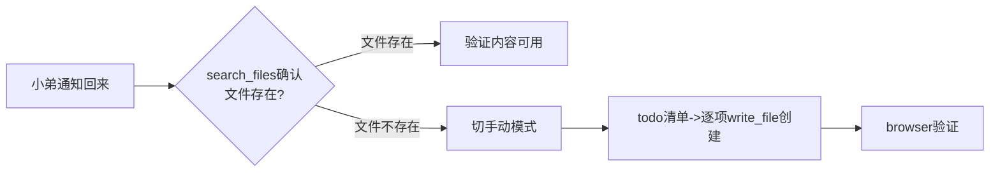

## 第一原则：说派小弟就必须真的派

### ⚠️ 你必须遵守的规则

用户会用「派小弟去」「让小弟搞」明确表达要异步。**如果自己先查了根因再写 prompt 派出去，用户会说你这叫「每次都派小弟去，最后还是自己上手」**。

**MUST DO — 立刻检查：**
- ⬜ 用户说了"派小弟"？→ 秒写 prompt 派出去，不自己查任何东西
- ⬜ 用户说了"异步搞"？→ 直接 terminal(background=True)，不等
- ⬜ 任务涉及修改代码？→ 让小弟自己读代码+修，不用我先读

**MUST NOT DO — 绝对不要：**
- ❌ 不要自己先 read_file 查根因再派 — 这叫"自己做"，不是"派小弟"
- ❌ 不要自己先跑 terminal 验证再派 — 这也叫"自己做"
- ❌ 不要"口头答应派，然后自己默默改了" — 用户一眼就看穿
- ❌ 不要觉得自己动手更快 — 老大明确说"效率高一点"

**正确节奏：**
1. 看到 trigger → 立刻写 prompt → dispatch → 秒回「派出去啦~」
2. 写得短（<2500字），写得快（<1分钟），立即派
3. 回完继续聊别的，不等

写一个 500 字的 prompt 让小弟自己查根因+修，比自己查5分钟再派快得多。**这在用户面前看起来完全不一样**——前者是「派了个活给小弟」，后者是「自己忙活了半天才想起小弟」。

### 本轮会话的验证案例（2026-05-05）

用户说「继续啊 不过你每次都说派小弟去 做后都自己上手 呵呵 效率高一点哈」。

用户纠正后的正确做法：
1. 写了两个各~2000 字的 prompt（一个修 TabManager 底栏，一个修 total_cny）
2. 同时并行 dispatch → 秒回老大「派出去啦~」
3. 老大回复「这回就对了 聪明」
4. 两个小弟 9 分钟跑完，验证通过

⚠️ 这是一个被明确纠正→改进→被赞的典型案例。必须记住这个模式。

---

## ⚡ 使用前必看：async-delegate 就是默认选项

**所有子 agent 任务首选 async-delegate。** delegate_task 不是平级选项，而是兜底渠道。

| 对比项 | delegate_task（同步） | async-delegate ✅ 默认 |
|--------|----------------------|----------------------|
| 容断能力 | ❌ 父上下文 compaction → 小影像没存在过 | ✅ 独立进程，父断子续 |
| 结构化结果 | ✅ 返回值直接可用 | ✅ v8 已加 `--result-file`，json.load 即可 |
| 嵌套委托 | ✅ 自带 orchestrator 角色 | ✅ v8 已加 `--nested` 指引 |
| 任务链 A→B→C | ✅ 同步串行 | ⚠️ 建议拆成并行+等结果，效果更好 |
| 不阻塞主对话 | ❌ 等它跑完才能继续聊 | ✅ terminal bg，秒回「派出去啦~」 |

> **结论：** 哪怕是查一个数、读一个小文件，只要不需要立即拿结果回话，就走 async-delegate。
> delegate_task 唯一的保留场景是「必须在同一次对话回合里拿到结果才能决定下一步说什么」——但这个场景少之又少，且 compaction 随时可能让它白干。

---

## ⚡ 选择正确的分发模式

async-delegate 支持**三种分发模式**，按协作复杂度由低到高：

### 模式一：多任务并行（`--tasks-file`）⭐ 最高效
- **特点**：多个子 agent 同时独立工作，互不通信
- **适用**：独立任务、分头行动、结果汇总
- **耗时**：总时长 ≈ 最慢那个子 agent，不叠加
- **示例**：同时改 Controller + View + Route

```
子agent-A ──┐
             ├──→ 各自独立跑 → 汇总结果
子agent-B ──┤
子agent-C ──┘
```

### 模式二：两阶段辩论（`--debate-file` + `parallel` 标记）
- **特点**：阶段内并行，阶段间串行，有信息传递
- **适用**：正反对比、方案评审、最终综合裁判
- **耗时**：阶段1并行 ~max(T₁,T₂) + 阶段2 ~T₃
- **关键**：用 `parallel: true` 让同阶段任务并行跑

```json
[
  {"role": "正方", "reads": [],      "parallel": true},
  {"role": "反方", "reads": [],      "parallel": true},
  {"role": "综合", "reads": ["正方","反方"], "parallel": false}
]
```

```
阶段1（并行）:  正方 ──┐
                     ├──→ 综合裁判官
                  反方 ──┘

阶段2（串行）:  综合读双方结论 → 最终报告
```

### 模式三：完全串行（顺序依赖链）
- **特点**：每个子 agent 必须等上一个完成才能开始
- **适用**：强依赖链（A的输出是B的输入）
- **耗时**：T₁+T₂+T₃（所有子 agent 时间相加）
- **注意**：能用模式二就不要用这个

> ⚠️ **实战结论（2026-05-05）**：串行链在 async-delegate 中效果不好。每个子 agent 是全新会话，不知道上一个的结果，需要中间文件传递状态，容错复杂。**建议拆法**：先并行跑 A+B（互不依赖的部分），等结果后再派 C。比硬做 A→B→C 链更可靠。

```
A → B → C（串行排队）
```

### 模式选择决策树

```
任务之间有信息依赖？
  ├─ 无 → 用顺序多次 --prompt-file（并行，不同文件）
  └─ 有
       ├─ 多方独立评审后综合 → 模式二（两阶段辩论）
       └─ 强顺序链（A→B→C）→ 不建议用串行链，改为拆成「并行 A+B → 再派 C」
```

> ⚠️ **经验总结**：实际工作中 80% 的场景用**模式一（并行）**，10% 用**模式二（两阶段辩论）**，10% 用**模式三（串行）**。拿到任务先问自己：这些子任务之间需要交流吗？

---

### TL;DR（单任务模板 — 默认带 caveman + result-file + output sanitization）

**快速复制这段，填3个东西。所有子 agent 默认 `--caveman --result-file`：**

```python
prompt = "帮我去做这个：{任务描述，越具体越好}"

write_file("/tmp/async_prompt.txt", prompt)

result_file = f"/tmp/async_result_{int(time.time())}.json"

terminal(
    command=f"python3 ~/.hermes/skills/async-delegate/scripts/async_delegate.py"
            f" --prompt-file /tmp/async_prompt.txt"
            f" --model minimax-m2.7"
            f" --toolsets terminal,file"
            f" --caveman"
            f" --result-file {result_file}"
            f" --subprocess-timeout 1800"
            f" --max-iterations 200",
    background=True,
    notify_on_complete=True,
    timeout=1800,
)
```

**要填的4个东西：**
1. `prompt = "..."` — 任务描述，越具体越好
2. `--model` — 看下面模型速查
3. `workdir`（terminal参数）— **默认 `/home/jionm5/workspace/`**，操作ERP等外部项目时**必须显式指定**（见下面场景D陷阱）
4. `result_file` — 自动生成唯一文件名，避免多小弟冲突

**⚠️ workdir 和 --workspace 必须同步：**
```python
# ✅ 正确：cd + --workspace 同时设
terminal(
    command=f"cd /mnt/d/laragon/www/erp_project && python3 ..."
            f" --workspace /mnt/d/laragon/www/erp_project"
            f" --caveman --result-file {result_file}",
    background=True,
    workdir="/mnt/d/laragon/www/erp_project",
    ...
)
```

**收到通知后读结果（不用 parse stdout）：**
```python
import json
with open(result_file) as f:
    result = json.load(f)
print(f"status={result['status']}, answer={result['answer'][:200]}, duration={result['duration_s']}s")
```

> 💡 `--result-file`：收通知后直接 json.load 拿结构化数据。`--caveman`：子 agent 省话不啰嗦，省 token 省时间。

### 模式一：顺序多次 `--prompt-file`（推荐）⭐

**`--tasks-file` 有 bug，不要用。** 多任务改为顺序多次 `--prompt-file` 调用，通过 `process(action="list")` 收集结果。

> ⚠️ **重要（2026-05-02）**：`--tasks-file` 模式在 2026-05-02 实测所有子 agent 0秒退出（`reads` 字段 bug），必须改用此方案。

```
子agent-A（--prompt-file） ──┐
                              ├──→ process list 收集 → 汇总
子agent-B（--prompt-file） ──┤
子agent-C（--prompt-file） ──┘
```

每次调用：
```bash
write_file("/tmp/task_A.json", json.dumps([{"id":"taskA","prompt":"...","model":"...","toolsets":"terminal,file"}]))
# 启动 task A
terminal(command="...async_delegate.py --prompt-file /tmp/task_A.json ...", background=True)
# 立即启动 task B（不等 A 完成）
write_file("/tmp/task_B.json", ...)
terminal(command="...async_delegate.py --prompt-file /tmp/task_B.json ...", background=True)
# ...
# 收集全部结果
process(action="list")
```

---

## 🎭 两阶段辩论模板（模式二）

用于方案评审、正反对比：**阶段1并行**（正方+反方同时跑），**阶段2串行**（综合读双方结论）。

```json
[
  {
    "role": "正方",
    "identity": "架构审查官",
    "model": "minimax-m2.7",
    "toolsets": "terminal,file",
    "sysmsg": "你是一个严谨的架构审查官...",
    "prompt": "评估方案A的可行性...",
    "reads": [],
    "parallel": true
  },
  {
    "role": "反方",
    "identity": "风险审计官",
    "model": "minimax-m2.7",
    "toolsets": "terminal,file",
    "prompt": "分析方案B的风险...",
    "reads": ["正方"],
    "parallel": true
  },
  {
    "role": "综合",
    "identity": "综合裁判官",
    "model": "minimax-m2.7",
    "toolsets": "terminal,file",
    "prompt": "综合双方结论，给出最终建议",
    "reads": ["正方", "反方"],
    "parallel": false
  }
]
```

**关键字段**：
- `reads`: 列出要注入哪些角色的结论（如 `["正方"]` 在执行前把正方的结论注入 prompt）
- `parallel`: `true` = 与其他 `parallel=true` 的任务并行跑；`false` = 等所有 `parallel=true` 完成后才跑

**启动辩论**：
```bash
python3 ~/.hermes/skills/async-delegate/scripts/async_delegate.py \
    --debate-file /tmp/debate.json \
    --workspace /home/jionm5/workspace/stock_monitor_project
```

**回老大**：`"派出去啦~ 正方+反方并行跑，跑完综合裁判官汇总，预计5分钟。"`

---

## ⚠️ MiniMax 128k 上下文限制：任务必须拆短

**老大约束**：MiniMax M2.7 只有 128k 上下文（不是 DeepSeek 的 1M），太长的 prompt 会被截断或答非所问。

**实战验证**（2026-05-05）：
- 2000 字的 prompt 在 MiniMax 上跑 **3-5 分钟**，状态 `done`
- 两个相同量级的任务并行跑（不同文件）总共 9 分钟，无超时无错误
- `--subprocess-timeout 600 --max-iterations 80` 对简单改代码足够

**经验法则**：
- 每个 prompt 文件不超过 **2500 字**（中文）
- 超出则拆成多个顺序 `--prompt-file` 调用
- 涉及多文件改动时，**每个文件一个子 agent**（分开跑）→ 不同文件可以并行不冲突
- 读大文件（1500+ 行代码）要让子 agent 自己去读，不在 prompt 里贴全文
- `--subprocess-timeout` 简单任务设 600（10分钟），大活儿才加
- `--max-iterations` 简单修 bug 设 80，重构才 200+

**⚠️ 特别陷阱：先自己查一把再派——等于没派**

如果我先用 `read_file/terminal` 查了根因再写 prompt 派小弟，用户会说你「每次都说派小弟去，最后还是自己上手」。每多花 10 秒自己查，就多 10 秒没派。

正确做法：**写得越短越要直接派**。写一个 500 字的 prompt 让小弟自己查根因+修，比自己查5分钟再派快得多。老大要的是「秒回派出去啦」的节奏感，不是「等我查完再告诉你结果」。

**检查清单——我真的派出去没？**
- ⬜ 我一分钟之内 dispatch 了？
- ⬜ prompt 没超过 2500 字？
- ⬜ 没有先自己 read_file 查代码再写 prompt？
- ⬜ 回老大「派出去啦~」之后没继续自己动手改？

## 模型选择速查

| 模型 | 适合场景 | 说明 |
|------|---------|------|
| `minimax-m2.7` | 日常简单/批量任务 | 套餐免费，默认用这个 |
| `deepseek-v4-flash` | 复杂长程任务（改代码、写UI、分析推理） | 上下文1M，大活才切 |

**原则：** 日常用 MiniMax M2.7（免费套餐），复杂长程任务（改代码、写UI、全量导入等）手动切 `deepseek-v4-flash`。

---

## ✅ 跨模型输出保障（v10，自动生效）

子 agent 的 `answer` 输出会自动经过**双重清洗**，确保 MiniMax 的输出不会炸 DeepSeek，反之亦然：

### 系统消息层（源头约束）

所有子 agent 自动附带「输出格式规范」指令：

```
【输出格式规范】你的最终输出必须符合以下标准：
1. 纯 UTF-8 编码，无 BOM (U+FEFF)，无控制字符（仅保留换行和制表符）
2. 无零宽字符 (U+200B U+200C U+200D U+FEFF 等)，无模型专属标记符号
3. 所有字符串内容标准 JSON 转义，确保可以被 json.load() 直接解析
4. 不输出思考过程、推理痕迹、或任何标记语言包装
5. 中文内容保持普通汉字，不使用异体字或特殊 Unicode 组合
```

### 代码层（兜底清洗）

`_sanitize_output()` 在写入 result 文件前暴力过滤：

| 过滤项 | 原因 |
|--------|------|
| BOM (U+FEFF) | 某些 provider 在流式输出开头塞 BOM |
| 零宽字符 (U+200B/C/D 等) | MiniMax 输出中常见，DeepSeek 解析崩溃 |
| 控制字符 (0x00-0x08/0x0b/0x0c/0x0e-0x1f/0x7f) | 炸 JSON 解析器 |
| 非法代理对 (U+D800-U+DFFF) | 不合规 UTF-16 代理炸 Python json |

**不需要在 prompt 里手动处理**——全自动，拿到的 result 文件里的 `answer` 已经是干净的。

---

## ⚠️ 子 agent 改 Blade 后的验证清单（2026-05-05 教训）

子 agent 改完 Blade 模板（form/show/index），**必须验证以下项**，不能只检查 git diff：

### JS 验证
- [ ] JS 在 `$(function(){...})` 内（DOM ready 包装）
- [ ] 事件绑定用 `$(document).on(...)` 委托，非 `$(...).click(fn)` 直接
- [ ] 所有 jQuery selector 引用的 HTML 元素在模板中**实际存在**
- [ ] 所有 `$.post()`/`$.ajax()` 调用带 `_token` 参数
- [ ] 无 `$quote->xxx` 模式（PHP 8 中 `$null->prop ?? ''` 不生效，用 `$quote?->xxx ?? ''`）

### 页面验证
- [ ] `curl -b <cookies> <url>` 返回 200
- [ ] 关键按钮/弹窗存在于 HTML 中：`curl -s | grep -c 'selector'` > 0

### 缓存
- [ ] `rm -f storage/framework/views/*.php`
- [ ] `php artisan octane:reload`

---

## 完整参数速查

| 参数 | 默认值 | 说明 |
|------|--------|------|
| `--prompt-file` | — | 99%场景用这个（防转义），读取文件内容作为 prompt |
| `--model` | `minimax-m2.7` | 默认 MiniMax（免费）。复杂任务切 `deepseek-v4-flash` |
| `--toolsets` | `terminal,file` | 需要浏览器/搜索时传 `browser,web` 等 |
| `--workspace` | `/home/jionm5/workspace/` | 子agent的工作目录，操作外部项目时需显式指定 |
| `--subprocess-timeout` | `1800`（30分钟） | 子进程外部硬截止时间。到点强制kill，不管任务完没完 |
| `--max-iterations` | `200` | 子agent内部最大工具调用次数。到数强制停 |
| `--result-file` | — | **v8 新增**：把结构化结果写入JSON文件，主agent直接读取不用parse stdout |
| `--nested` | — | **v8 新增**：允许子agent再派自己的子agent（嵌套委托）|
| `--caveman` | — | **v9 新增**：原始人模式，子 agent 说重点。**所有子 agent 默认应使用此参数** |
| `--sysmsg` | — | 附加系统消息前缀，不常用 |

---

## 三步流程

### Step 1：写 prompt + 启动
见上面的 TL;DR 或多任务模板。

## 📝 Prompt 编写技巧（2026-05-03 实践总结）

从今天重构 1600 行订单编辑页（543 行变动的成功案例）中总结的经验：

### prompt 结构模板

```
你是「身份名」，负责……

## 任务文件
{文件全路径}

## 当前状态
{一句话说清现在是什么样}

## 目标
{列出要改什么，每项独立条目}

## 关键约束
- 保持现有的……（数据绑定/错误处理/样式等）
- 不要删减：……（列出现有功能不能动的）
- 不要改动：……（说不让动的区域）

## 验收清单（可执行的检测项）
1. 页面能打开不报错
2. 具体特征 A
3. 具体特征 B
```

### 要点
1. **给出精确列表示意** — 列结构用表格，让子 agent 可以逐行对照，不打乱顺序
2. **包含代码片段** — 关键 JS 逻辑（如键盘导航的事件绑定）直接贴代码，子 agent 会复用你的风格
3. **明确边界** — "不要删减现有功能" + "不要改动XX区域" 防止过度发挥
4. **复杂任务加迭代** — 大模板（1500+行）需要 `--max-iterations 300 --subprocess-timeout 3600`

### 反面案例 vs 正面案例

❌ 太模糊：「帮我重构订单编辑页的表格」
✅ 带表格 + 每个列的宽度 + 数据属性命名 + 四套模板的序号

### 参考案例
见 `/tmp/order_form_rewrite.txt`（2026-05-03 成功执行的 prompt 原文）

---

## 🚨 子 agent 前端 JS 常见 Bug 清单

**2026-05-05 实战教训**：两次派小弟改 Blade 前端 JS，连续踩到 5 个同一类坑。原因：prompt 没说「JS 必须怎么写」，子 agent 按通用知识写了有问题的代码。以下是 prompt 中必须明确的约束：

### ❌ 1. JS 脱离 `$(function(){...})` 包装

子 agent 在 `@push('scripts')` 中直接写 `$(\"...\").click(fn)`，但 `@push('scripts')` 推送到 layout，JS 不自动在 DOM ready 后执行。元素尚未解析 -> 绑定到空集 -> 静默失败。

**必须要求在 prompt 中写：** 所有 jQuery 代码包裹在 `$(function(){...})` 中。

### ❌ 2. 直接绑定代替委托绑定

`$(\"#confirm-save-version\").click(fn)` 在元素不存在时绑定无效。

**必须要求：** 使用 `$(document).on('click', 'selector', fn)` 委托绑定。尤其元素被 `@if` 包裹、由 JS 动态添加、或弹窗内按钮。

### ❌ 3. JS 引用的 HTML 元素不在模板中

子 agent 的 JS 引用 `#version-save-modal`、`#version-note-input`、`#confirm-save-version`，但对应的 modal HTML 没加在模板里。JS 不报错、不弹窗、静默失败。

**必须要求在 prompt 中写：** 列出所有 JS 引用的 HTML 元素 ID，确认每个在模板中有对应元素。

### ❌ 4. `$.post()` 缺 `_token`

Laravel CSRF 保护拦截 -> 返回 419 -> 浏览器跳到登录页。看起来像 session 过期，实际是 CSRF 问题。

**修复：** `$.post(url, { ..., _token: $(meta[name=csrf-token]).attr(content) }, fn)`。或在 prompt 中要求全局 `$.ajaxSetup({ headers: { 'X-CSRF-TOKEN': ... } })`。

### ❌ 5. PHP 8 中 `$null->prop ?? ''` 不生效

`$quote->valid_until?->format('Y-m-d')` 在 `$quote=null` 时报 500。第一个 `->` 就崩了，`?->` 只保护 `valid_until` 字段不为 null，不保护 `$quote` 变量为 null。

**修复：** `$quote?->valid_until?->format('Y-m-d')` — 第一个 `?->` 在 `$quote` 上。Blade 模板中所有 `$var->prop ?? ''` 必须改为 `$var?->prop ?? ''`。

### 检查清单 — 派小弟改前端 JS 前必加

在 prompt 末尾追加这段：

```
## JS 约束（必须遵守）
1. 所有 JS 包在 $(function(){...}) 内
2. 事件绑定用 $(document).on('click', 'selector', fn)
3. 所有 JS 引用的元素 ID 在模板中必须有对应 HTML
4. $.post() 必须带 _token（或全局 $.ajaxSetup）
5. Blade 中 $var->prop 必须用 $var?->prop（PHP 8 nullsafe）
```

---

### Step 2：立刻回老大
```
"派出去啦~ 让小影去搞[任务名]，等结果回来汇报。"
```
回完继续聊别的，不等。

## 🧠 子 agent 结论是建议，不是决策

**重要教训（2026-05-06）：** 老大派小影分析方案，小影给出了"不该搞，方案A有坑"的结论。但老大看了说"感觉还是你开始提的那个方案靠谱"——**他最终选择了我最初的设计，而非小影的优化建议。**

这意味着：

1. **子 agent 的结论是分析参考，不是最终判断。** 老大有自己的架构直觉和取舍标准。
2. **不要把子 agent 的结论当圣旨**。小影说"方案A有坑"不代表方案A不能做——老大的判断力比子 agent 更准。
3. **汇报子 agent 结论时，要区分"事实"和"判断"**。小影发现的"JSONL没有成交量字段"是事实，必须采纳；"条件表达式解析器是自造轮子"是判断，老大可以驳回。
4. **当老大明确说"还是你开始提的方案靠谱"时，果断回到初始方案**，不要纠结子 agent 的分析。

## 审核验收（必做）

```bash
cd /mnt/d/laragon/www/erp_project  # 或其他项目目录
git log --oneline -5   # 看小弟是否留下了 commits
git diff HEAD~1..HEAD --stat  # 看改了哪些文件
git diff HEAD~1..HEAD  # 看具体改了啥
```

**如果小弟没干活：** 切手动模式（见下方兜底方案）

---

## ⚠️ 多任务并行风险：同一文件冲突

**`--tasks-file` 模式下的并行子 agent 如果修改同一文件，有冲突风险。**

真实案例：列排序任务和弹窗懒加载任务同时修改 `index.blade.php`，因为线程池调度恰好错开了写入时间，git 自动合并成功。但如果两个 worker 同时写同一文件的同一区域，后提交的会覆盖前一个的改动。

**建议：**
- 多任务尽量选**不同文件**（如一个改 Controller、一个改 View、一个改 Route）
- 如果必须改同一文件，拆成单次顺序执行（分两次 `--prompt-file` 调用，不要用 `--tasks-file`）
- 审核时特别注意 `git diff` 检查有没有丢失预期改动

---

## 🎭 子 agent 身份设计（重要！）

**每次派小弟，先给它一个响亮的身份头衔。**

经验证明：有身份的子 agent 比没身份的调用质量高得多。

| 任务类型 | 推荐身份 | 效果 |
|---------|---------|------|
| 数据库/后端改动 | **架构审查官** | 更注重数据一致性、安全性、边界情况 |
| 前端UI/交互改造 | **前端建构师** | 更关注用户流程、交互细节、视觉一致性 |
| 代码审查/Bug修复 | **代码审计员** | 更严格地逐行分析、发现潜在问题 |
| 数据导入/清洗 | **数据治理员** | 更重视数据完整性和异常处理 |
| 规划/设计决策 | **方案分析师** | 更结构化地权衡方案优劣 |

**使用方式：** 在 prompt 开头明确写一句，例如：
```
你是「架构审查官」，负责数据层的安全底线，眼里容不下数据不一致。
```

这会引导子 agent 调用与之匹配的知识域和思考模式。

---

## 常见问题与边界处理

### 🚨 子 agent "只说不干" 诊断流程

**症状**：后台通知回来了，但 `status: "partial"`、`answer: "(no answer produced)"`、耗时不到 10 秒。

**三板斧排查（按顺序）：**

1. **看 stderr 里的 provider**
   ```
   [async_delegate] Using model=minimax-m2.7 provider=minimax-cn
   ```
   如果 `provider=` 不是你的主模型 provider（如应为 `deepseek` 却显示 `minimax-cn`），说明 **provider 解析错误**。
   
   **根因**：`async_delegate.py` 搜索 `cfg['providers']`（可能是空字典 `{}`）找不到 model，回退到 `delegation.provider`。
   
   **修复**：确认代码读的是 `cfg.get("model", {}).get("provider", "deepseek")`，不是 `providers` 或 `delegation`。见 v6 修复日志。

2. **检查 API key 是否存在**
   ```bash
   python3 -c "
   from hermes_cli.config import load_env
   env = load_env()
   print('DEEPSEEK_API_KEY in env:', 'DEEPSEEK_API_KEY' in env)
   "
   ```
   如果为 `False`，说明 `.env` 文件未加载。

   **根因**：`async_delegate.py` 作为独立进程启动，`hermes_cli` 不自动加载 `.env`。
   
   **修复**：`main()` 入口调用 `load_env()` 注入所有环境变量。见 v6 修复日志。

3. **验证 resolve_runtime_provider 能拿到 key**
   ```bash
   python3 -c "
   from hermes_cli.runtime_provider import resolve_runtime_provider
   from hermes_cli.config import load_env
   for k, v in load_env().items():
       import os; os.environ.setdefault(k, v)
   rt = resolve_runtime_provider(requested='deepseek')
   print('api_key exists:', bool(rt.get('api_key')))
   print('base_url:', rt.get('base_url'))
   "
   ```
   如果 `api_key exists: False`，说明环境变量没传递到 `resolve_runtime_provider`。

4. **验证已修复** — 重新跑一次简单测试：
测试：
   echo '帮我写一行文字到 /tmp/async_test.txt' > /tmp/async_test_prompt.txt
   python3 async_delegate.py --prompt-file /tmp/async_test_prompt.txt --model minimax-m2.7 --toolsets terminal,file
   ```
   - 修复前：~5 秒完成，`status: "partial"`，`answer: "(no answer produced)"`
   - 修复后：~11 秒完成，`status: "done"`，`answer` 有实际内容

### 场景A：API key 失效
如果子agent启动后报错（如 401），先检查环境变量：
```bash
echo $DEEPSEEK_API_KEY | head -c 10
```
缺 key 则手动设一下再重试。

### 场景A1：子 agent 跑到错误的工作目录
**症状**：子 agent 读不到文件，返回"文件不存在"。
**原因**：`--workspace` 参数未设，默认为 `/home/jionm5/workspace/`。但 ERP 项目实际在 `/mnt/d/laragon/www/erp_project`。

项目在 `/mnt/d/laragon/www/erp_project` 时，**必须**传 `--workspace /mnt/d/laragon/www/erp_project`。prompt 里写绝对路径没用——terminal 的 cwd 由 workspace 决定。

**注意**：`cd /mnt/d/... &&` 管道前缀不影响 async_delegate.py 自己的 workspace 解析。必须用 `--workspace` 参数。

### 场景B：子agent超时
`notify_on_complete` 没触发 → `process(action="poll")` 看状态：
- 如果是 `timeout` → 检查耗时。默认 **30分钟** 超时 + **200次** 工具调用上限，能跑完绝大多数任务。
  如果确实超出（比如全量数据导入上百万条），派小弟时加上 `--subprocess-timeout 3600 --max-iterations 400` 放宽。
- 如果是 `running` → 继续等

**特殊情况：delegate_task 的 orchestrator 角色超时（600s 上限）**
- orchestrator 子agent 的默认超时是 600 秒（10分钟）
- 如果 orchestrator 已经在 600 秒内完成了大部分工作（改了文件、创建了视图等），但最后一步（如 git commit）超时了，**不要重跑整个任务**
- 解决方案：`git diff --stat` 检查已完成的改动，手动提交，跳过超时部分的收尾步骤
- 后续可考虑把 orchestrator 拆成多个 leaf 子 agent 并行跑，避免单点超时问题

### 场景C：通知没收到
`process(action="list")` 查所有后台进程，找到对应的 session_id 手动 poll。

### 场景D：⚠️ 关键陷阱 — `cd /path &&` 不等于 `--workspace`

**2026-05-05 实战教训**：派小弟修 `/mnt/d/laragon/www/erp_project`，terminal 用了 `cd /path &&` 但没传 `--workspace`。结果：
- terminal 启动目录 = ✅ 正确
- async_delegate.py 内部 `cwd=workspace` 默认 = `/home/jionm5/workspace/` ❌
- 子 agent 的 read_file/write_file 在错误目录操作

**修复**：`cd` 和 `--workspace` 必须同时设：
```python
terminal(command=f"cd /mnt/d/laragon/www/erp_project && python3 ..."
                f" --workspace /mnt/d/laragon/www/erp_project"
                f" --result-file ...", ...)
```

### 实战模式：ERP功能三步走（最优实践 2026-05-05）

ERP 新功能实现的标准三步拆法，每步一个短 prompt（≤2500 字），可顺序或并行派：

**第1步：DB 层** — 建 migration + Model + 关联
- 文件: database/migrations/*.php + app/Models/*.php
- 目标：表建好，Model 可查
- 验证：php artisan migrate + `Schema::hasTable()`

**第2步：API 层** — 建 Controller + Routes
- 文件: app/Http/Controllers/Erp/*.php + routes/web.php
- 目标：路由可用，返回 JSON
- 验证：curl POST 测试

**第3步：UI 层** — 改 Blade 模板 + JS
- 文件: resources/views/pages/orders/*.blade.php + 内联 JS
- 目标：用户可见交互
- 验证：浏览器操作

**关键原则**：
- 每一步独立 prompt，互不依赖（第2步只需知道 Model 类名，不依赖 migration 运行）
- prompt 里写清楚"当前状态"（上一步已完成什么），避免子 agent 从零开始
- 每步用 minimax-m2.7，timeout 600, iter 60-80
- 第1步和第2步可并行（改不同文件），第3步等前两步完成再派
- 动手前先把设计文档写到 Wiki，存档后再开干
如果小弟创建的文件不在你期望的位置，检查是否传了正确的 `workdir`。
小技巧：prompt 里提到特定项目名（如"ERP"、"Wiki"）时，检查 terminal 参数有没有带 `workdir=`。

---

## 什么时候回退到 delegate_task

**很少需要。** async-delegate 是默认选项，以下情况才考虑 delegate_task：

- **同一回合需要结果来决策**：你的下一句话依赖子 agent 的返回内容，无法拆成"派出去→聊别的→回头读 result-file"
- 且确认当前不会发生 compaction（上下文还很充裕）

> ⚠️ **v8 升级后，`--result-file` 覆盖了 delegate_task 最大的优势**（结构化结果），`--nested` 覆盖了嵌套委托。剩下只有「非得同回合拿结果」这一个理由用 delegate_task，而且 compaction 随时可能让这个理由也不成立。

**经验法则：** 实在不确定时，走 async-delegate + `--result-file` 准没错。收到通知后再读文件拿结果，既安全又结构化。

---

## 兜底恢复方案（小弟没干活时）



手动恢复：开 todo 清单逐项 write_file 创建，每完成一组跑验证。

---

## ⚠️ `--debate-file` 与 `--tasks-file` 模式已知 Bug（2026-05-02）

**结论：两个文件驱动模式都不能用。** 如需并行派多个子 agent，用**顺序多次 `--prompt-file`** 代替。

### Bug 1 — `--debate-file` 辩论模式（已确认）

**症状**：所有子 agent 0秒退出，报 `{"status": "error", "error": "expected str, bytes or os.PathLike object, not list"}`

**根因**：`run_debate()` 函数中，`reads` 字段（list 类型）被传给了需要文件路径字符串的函数，`json.loads(last_line)` 返回了 list 而非 dict，后续 `os.path.expanduser()` 拿到 list 直接崩溃。

### Bug 2 — `--tasks-file` 多任务模式（已确认）

**症状**：所有子 agent 0秒退出，同上错误 `expected str, bytes or os.PathLike object, not list`

**根因**：与 Bug 1 同款——`_spawn_worker()` 在构造子进程命令时，`reads` 字段（来自任务 dict 的 `reads` 键）被当作文件路径字符串处理，传给了 `os.path.expanduser()` 或类似函数，list 类型导致崩溃。

**实际验证**（2026-05-02）：
```
--debate-file: "duration_s": 0, "error": "...not list"
--tasks-file:  "duration_s": 0, "error": "...not list"
```

两个独立模式，同一个错误，指向同一个代码缺陷（`reads` 字段处理逻辑有 bug）。

**临时方案**：多任务场景改用顺序多次 `--prompt-file` 派单个小弟，并行结果通过 `process(action="list")` 收集。

---

## ✅ 修复日志

### v10 — 跨模型兼容（2026-05-06）

**问题**：①子 agent 默认模型硬编码为 `minimax-m2.7`，不跟随 Hermes 主配置，其他用户使用时无法自动适配。②MiniMax 输出中的零宽字符/控制字符传给 DeepSeek V4 时编码崩溃。

**改动：**
1. **默认模型动态解析** — 新增 `_resolve_default_model()`，读取 `~/.hermes/config.yaml` 的 `model.default` 作为默认模型。所有硬编码 `"minimax-m2.7"` 替换为动态解析，不再手动指定 `--model`。无配置时优雅回退至 `minimax-m2.7`
2. **输出格式清洗** — 新增 `_sanitize_output()`，自动去除 BOM、零宽字符、控制字符、非法代理对
3. **系统消息指令** — 新增「输出格式规范」约束子 agent 输出标准 UTF-8
4. **换行符修复** — caveman directive 的换行符从字面量改为真正换行符

**验证：** smoketest ✅ | 默认模型解析 `deepseek-v4-flash` ✅ | 输出清洗 ✅ | 语法检查 ✅

### v9 — 原始人模式 --caveman + 默认参数模板（2026-05-05）2026-05-05 生产验证：派两个小弟修 ERP bug（报价单创建崩溃 + 订单新增行不换算），其中一个用 `--caveman`+`--result-file` 96s 完工，结果完整可读。

**改动：**
1. 新增 `--caveman` 参数 → 子agent系统消息中加入原始人模式指令
2. TL;DR 模板将 `--caveman` + `--result-file` 设为默认参数组合
3. 所有后续子 agent 派发默认带 `--caveman`
4. 用户明确确认：子 agent 应该也用原始人模式

## v8 — 结构化结果 + 嵌套委托（2026-05-05）

**老大发现**：`delegate_task` 的三项优势（结构化结果、任务链、嵌套）在上下文 compaction 时同样会丢失，且 async-delegate 大部分场景可以覆盖。要求把能做的做起来。

**改动：**

1. **`--result-file`**（结构化结果输出）
   - 子 agent 跑完后把完整结构化 JSON（含 `status/answer/duration_s/model`）写入指定文件
   - 主 agent 收 `notify_on_complete` 后直接 `json.load(文件)` 拿数据，不用 parse stdout
   - 适用于需要可靠读取子 agent 成果的场景

2. **`--nested`**（嵌套委托）
   - 子 agent 的系统消息中加入「你也可以派小弟」的指引
   - 指导子 agent 用 `async_delegate.py` 派出自己的 sub-sub-agent
   - 明确限定：只派独立并行任务，不派链式依赖

3. **路径修复**
   - `_AGENT_ROOT` 从 `Path(__file__).parent.parent.parent` 改为 `Path.home() / "hermes-agent"`——原路径深度算错导致 `ModuleNotFoundError`

**验证：**
- `--result-file`：8.5s 完工，result JSON 内容完整可解析 ✅
- `--nested`：系统消息附加正常，子 agent 正常跑完 ✅

### v7 — 子 agent 超时范围放开 + 参数可配（2026-05-03）

**老大指示**：长任务应该走异步模式，不阻塞主对话。既然异步不阻塞，时间和迭代次数没必要太紧。

**改动：**
1. `_spawn_worker()`：`subprocess.run(timeout=900)` → 默认 **1800**（30分钟），可通过 `--subprocess-timeout` 覆盖
2. `AIAgent()`：不传参数（默认取 90 次）→ 改为传 `max_iterations=200`，可通过 `--max-iterations` 覆盖
3. `--tasks-file` 和 `--debate-file` 模式同样继承了新参数：子进程命令里带上 `--subprocess-timeout` 和 `--max-iterations`
4. SKILL.md 同步更新：TL;DR 模板、参数速查表、超时场景

**注意事项：**
- `terminal(timeout=N)` 需要和 `--subprocess-timeout` 保持一致，否则 terminal 层会提前掐断子进程
- `delegate_task` 的同步通道维持原 600s/50 次不变（老大的意思：要等就不能太久）

### v6 — 子 agent 空跑修复（2026-04-29）

**同时修复三个问题：**

**① Provider 解析错误** — 代码扫描 `cfg['providers']`（配置中为 `{}` 空字典）找不到 model，回退到 `delegation.provider=minimax-cn`，导致用 minimax 调 deepseek 模型名。
→ 改用 `cfg['model']['provider']`（主模型 provider = deepseek）

**② `.env` 未加载** — `async_delegate.py` 作为独立 Python 进程启动，`hermes_cli` 不自动加载 `.env`。`DEEPSEEK_API_KEY` 不在环境变量里，`resolve_runtime_provider()` 返回空 key。
→ `main()` 入口调用 `load_env()` 注入凭证

**③ `toolsets` 变量未定义** — `run_single()` 中 `if not toolsets:` 在 `toolsets = []` 声明前引用，多任务 `--tasks-file` 模式 NameError。
→ 顺序调整为 `[]` → `if args.toolsets` → `if not: ["terminal", "file"]`

**验证：** 单任务 11s 完工 `status:"done"`。多任务 3 个并行（列排序/弹窗/缓存头）全 `done`，零错误零超时。

### v5 — 达尔文优化：任务判断 + 审核检查点（2026-04-29）

- 新增"使用前必看"决策树（30秒红线）
- Step3 细化审核流程：git diff 验收，不做就兜底
- 新增 API key/超时/通知丢失 4 个场景处理
- 单/多任务模板分拆为独立段

### v4 — 工作目录迁移（2026-04-29）

- 默认工作目录从 `os.getcwd()` → `/home/jionm5/workspace/`
- 剥离硬编码路径，需显式指定 workdir

### v3 — 小弟只说不干（2026-04-29）

**根因**：子 agent 工具集可能为空 + 缺强制执行指令。
**修复**：默认补 `terminal,file` + 系统消息尾追加中文强制执行指令。
